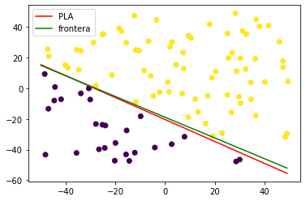
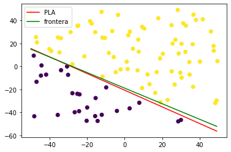
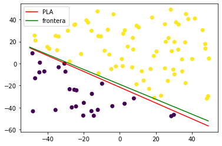
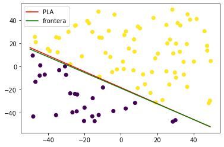
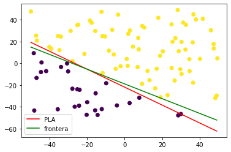
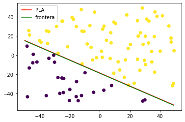
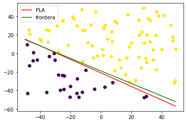
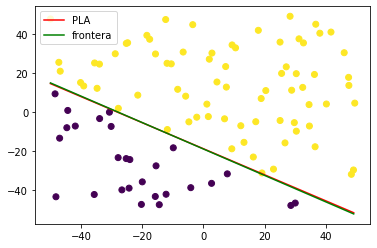

# **Práctica 2**
 
Celia Arias Martínez

## **Ejercicio 1**

En este ejercicio vamos a estudiar cómo se comportan determinadas funciones que definen la frontera de clasificación al intentar separar puntos de una muestra que contiene ruido.
Para ello utilizaremos las tres funciones proporcionadas en el template: *simula_unif*, *simula_gaus* y *simula_recta*.

### **Ejercicio 1.1**

En este apartado vamos a dibujar dos gráficas de nubes de puntos, cada una con una distribución diferente. Las dos tienen un tamaño de puntos igual a `50` y dimensión `2`. 

La primera gráfica de nubes de puntos sigue una distribución uniforme y los puntos están en un rango de $[-50,50]$.

El código es:

~~~py
def simula_unif(N, dim, rango):
	return np.random.uniform(rango[0],rango[1],(N,dim))

x_1 = simula_unif(50, 2, [-50,50])
plt.scatter(x_1[:,0], x_1[:,1], c ='r') 
plt.show()
~~~

La segunda gráfica de nubes sigue una distribución de gauss de parámetros $\mu = 0$ y $\sigma =[5,7]$. Para generarla vemos que llama a la función *simula_gaus*. Esta función fija la media a cero, y luego llama a la función *np.random.normal* para que genere el conjunto de puntos siguiendo una distribución normal, y utilizando para cada columna un sigma determinado. En este caso para el eje `x` utilizamos $\sigma = 5$, y para el eje `y` $\sigma = 7$.

El código explicado es:

~~~py
def simula_gaus(N, dim, sigma):
    media = 0    
    out = np.zeros((N,dim),np.float64)        
    for i in range(N):
        out[i,:] = np.random.normal(loc=media, scale=np.sqrt(sigma), size=dim)
    return out
~~~

### **Ejercicio 1.1**

En este apartado introducimos una función para etiquetar los puntos y un ruido.

Primero dibujamos una nube de puntos que sigue una distribución uniforme, según lo explicado en el apartado anterior. En este caso el tamaño de puntos será de `100`, la dimensión seguirá siendo `2`, y el intervalo será $[-50,50]$

La recta que usamos para etiquetar los puntos es
$f(x,y) = y-a*x-b$
donde los parámetros `a` y `b` los hemos obtenido con la función *simula_recta*.

Dibujamos el gráfico de puntos generado, así como la recta usada para etiquetar.

~~~py
x_3 = simula_unif(100, 2, [-50,50])
etiquetas=[]
a,b = simula_recta([-50,50])
for i in range(0,len(x_3)):
    etiquetas.append(f(x_3[i,0], x_3[i,1], a,b))
etiquetas = np.asarray(etiquetas)
t = np.linspace(min(x_3[:,0]),max(x_3[:,0]), 100)
plt.scatter(x_3[:,0], x_3[:,1], c =etiquetas) 
plt.plot( t, a*t+b, c = 'red') 
plt.show()
plot_datos_cuad(x_3, etiquetas_originales,g0_to_vector )
~~~

He definido una función para calcular el porcentaje de puntos mal etiquetados, que en este caso no tiene mucha utilidad porque sabemos que sera del $0\%$, pero la utilizaremos en los apartados siguientes.

El código es:

~~~py
"""
calculaPorcentaje: calcula la proporción de puntos mal clasificados
        x: muestra de puntos
        y: vector con las etiquetas
        g: función que clasifica los puntos de la muestra

        porcentaje_mal: proporción de puntos mal clasificada
"""
def calculaPorcentaje(x, y, g):
    
    mal_etiquetadas = 0
    for i in range(0,len(x[:,0])):
        etiqueta_real = y[i]
        etiqueta_obtenida = g(x[i,0], x[i,1])
        if (etiqueta_real != etiqueta_obtenida):
            mal_etiquetadas+=1

    porcentaje_mal = mal_etiquetadas / x[:,0].size
    
    return porcentaje_mal

~~~

Esta función lo que hace es calcular el valor de una variable llamada `mal_etiquetadas`, recorriendo todos los vectores de características y viendo si la etiqueta asignada coincide con la real. Por último calcula la media y devuelve dicho valor.

### **Ejercicio 1.2**

En este apartado modifico de forma aleatoria un 10% de los valores positivos, y un 10% de los valores negativos.
Para eso he creado dos vectores auxiliares, uno con las posiciones de los valores positivos, y uno con las de los negativos. 
Después he seleccionado aleatoriamente un 10% de números entre 0 y el tamaño del vector de positivos, y esos valores los he utilizado de índices en el vector de positivos, con lo que he obtenido un 10% de los índices de los valores positivos del vector original.
Con los valores negativos he hecho lo mismo, he concatenado los dos 
vectores y he cambiado los valores de los índices obtenidos.

~~~py
positivas = np.where(etiquetas == 1) 
negativas = np.where(etiquetas == -1) 
positivas = np.asarray(positivas).T 
negativas = np.asarray(negativas).T
ind_pos = np.random.choice(len(positivas), int(0.1*len(positivas)), replace = True)
cambiar_signo = positivas[ind_pos,:]
ind_neg = np.random.choice(len(negativas), int(0.1*len(negativas)), replace = True)
cambiar_signo = np.concatenate((cambiar_signo, negativas[ind_neg,:]), axis=0)
for i in range(0, len(cambiar_signo)):
    etiquetas[cambiar_signo[i]]=-etiquetas[cambiar_signo[i]] 
~~~

Porcentaje mal etiquetadas: 0.09

### **Ejercicio 1.3**

Tenemos ahora cuatro funciones diferentes, y vamos a ver cómo separan la muestra que tenemos, y cómo se comportan en cuánto al ruido. 

#### **Ejercicio 1.3.1**

$f(x,y) = (x-10)^{2}+(y-20)^{2}-400$

Porcentaje mal etiquetadas: 0.44

#### **Ejercicio 1.3.2**

$f(x,y) = 0.5*(x+10)^{2}+(y-20)^{2}-400$

Porcentaje mal etiquetadas: 0.5

#### **Ejercicio 1.3.3**

$f(x,y) = 0.5*(x-10)^2-(y+20)^2-40$

Porcentaje mal etiquetadas: 0.77

#### **Ejercicio 1.3.4**
$f(x,y) = y-20*x^2-5*x+3$

Porcentaje mal etiquetadas: 0.68

### **Conclusiones que se pueden extraer**
no hay aprendizaje-> va a haber un problema siempre
aunqeu tengamos un clasificador perfecto como hay ruido vamos a tener un error

no tienen por que ser mejores aunque sean mas complejas

más: reproducir el proceso anterior con las cuatro funciones
para ver que aunque tengamos una funcion mas compleja no podemos bajar del 10% porque el ruido de las etiquetas lo tenemos siempre

## **Ejercicio 2**

En el ejercicio anterior nos limitamos a estudiar cómo se comportaban diferentes funciones respecto a los datos, pero no había ningún proceso de aprendizaje pues las funciones estaban dadas. En este ejercicio vamos a implementar dos técnicas de aprendizaje lineal: el **perceptron** y **regresión logística**. 

### **Ejercicio 2.1**

El algoritmo **perceptron**  ajusta los pesos según una función signo, y obtiene como resultado un hiperplano que separa las regiones en dos. En el caso de que el problema sea separable sabemos que la convergencia está asegurada, aunque el número de iteraciones dependerá de factores como el punto de inicio y la distribución de la muestra. En problemas no separables sabemos que no podrá converger nunca.

El código de dicho algoritmo es:

~~~py
def ajusta_PLA(datos, label, max_iter, vini):
    w = np.copy(vini)
    iteraciones = 0
    for i in range ( 0, max_iter):
        iteraciones+=1
        stop = True
        for j in range (0, len(datos)):
            if(signo(w.T.dot(datos[j,:]).reshape(-1,1)) != label[j]):
                stop = False
                w = w + label[j]*datos[j,:].reshape(-1,1)
                
        if (stop):break
    
    return w, iteraciones
~~~

Lo primero que hace la función es inicializar el vector de pesos `w` con el valor del punto inicial. Después tenemos dos bucles: el bucle interior recorre todos los puntos de la muestra, y si el punto está mal clasificado corrige el vector `w` para adaptarlo a él. El bucle exterior se encarga de repetir el proceso las veces necesarias para que podamos recorrer todos los puntos sin cambiar nada, es decir que todos los puntos estén bien clasificados, o en su defecto hasta que lleguemos al número máximo de repeticiones.

#### **Ejercicio 2.1.1**

Vamos a probar ahora el algoritmo de **perceptron** con los datos del apartado 2a), es decir, con las etiquetas sin ruido. Vamos a variar el vector inicial para ver como influye en la convergencia hacia la solución.

Para este ejercicio no he utilizado la función proporcionada *plot_datos_cuad* porque he considerado que se veían mejor los cambios en las diferentes rectas generadas según el valor inicial si lo dibujaba solo con la recta generada, igual que en la práctica anterior.

Recordamos que la función frontera obtenida en el ejercicio anterior, y a partir de la cual etiquetamos los datos es:

$f(x,y) = y+0.6771584922002485 *x +18.89022818933684
$

* Vector inicial cero:

w : [[661.        ]
 [ 23.20241712]
 [ 32.39163606]]

 Número de iteraciones:  75

 Porcentaje mal etiquetadas: 0.04

 

* Vector inicial con números aleatorios entre [0,1]:
  

Porcentajes mal etiquedadas:  [0.04 0.03 0.04 0.03 0.04 0.04 0.03 0.03 0.03 0.03]

Iteraciones con cada valor inicial:  [261 224  69 202  72  75 133 250 224  37]

Número medio de iteraciones para converger:  154.7

Porcentaje medio de mal etiquetadas:  0.034

#### **Ejercicio 2.1.2**

Hacemos ahora el mismo experimento realizado antes con los datos del apartado 2b), es decir, con la introdución de ruido en las etiquetas.

* Vector inicial cero:

w:  [[289.        ]
 [ 18.97582326]
 [ 41.03650814]]

 Número de iteraciones:  1000
Porcentaje mal etiquetadas: 0.14

* Vector inicial con números aleatorios entre [0,1]:

Porcentajes mal etiquedadas:  [0.12 0.13 0.15 0.12 0.12 0.16 0.14 0.31 0.14 0.17]
Iteraciones con cada valor inicial:  [1000 1000 1000 1000 1000 1000 1000 1000 1000 1000]
Número medio de iteraciones para converger:  1000.0
Porcentaje medio de mal etiquetadas:  0.156

### **Ejercicio 2.2**

En este apartado vamoa a aplicar el algoritmo de **regresión logística**. 

al ser el problema linelmente separable los resultados siempre seran buenos

poner el eout??? np.log(1+np.exp(-y[i]*X[i].dot(w))) incluirlo (funcion de coste de regresion logistica)
incluir maximo minimo media variacion etc
comparar regresion logistica con perceptron
probar con ruido
