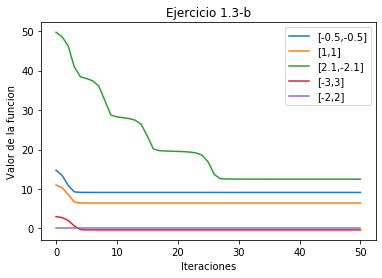
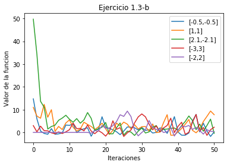
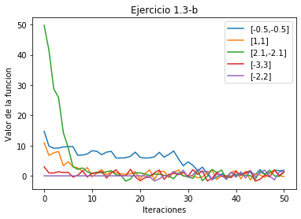
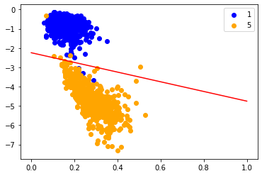
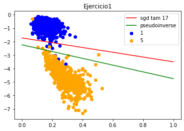
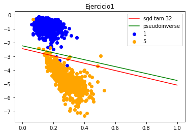
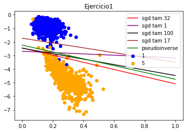
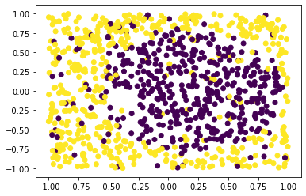
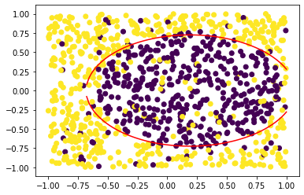

# **Práctica 1**
 
Celia Arias Martínez

## **Ejercicio 1**

### **Ejercicio 1.1**

En el ejercicio 1 se pide que se implemente el algoritmo de gradiente descendiente, y después que se ponga en práctica con una determinada función para ver la bondad de dicho algoritmo y ver como influyen los cambios en los parámetros.

El código del algoritmo es:

~~~python
"""
gradient_descent: función que implementa el algoritmo del gradiente descendiente
    p: punto inicial
    lr: learning rate
    maxIter: máximo de iteraciónes
    funcion: función a minimizar
    gradiente: gradiente de la funcion
    error_fijado: tasa de error permitida

    w: punto final donde se alcanza el mínimo de la función
    iterations: nº iteraciones realizado
"""
def gradient_descent(p, lr, maxIter, funcion, gradiente, error_fijado ):
    iterations = 0
    w = [p[0], p[1]]
    for j in range(maxIter):
        iterations += 1
        w = w - lr*gradiente(w[0], w[1])
        if (funcion(w[0], w[1]) < error_fijado) : break
    return w, iterations         
~~~

La función lo que hace primero es fijar el nº de iteraciones a 0 y tomar como primer valor de `w` el del punto inicial. Después entra en el bucle `for` del que solo sale si ha llegado al nº máximo de iteraciones, o si la función alcanza un valor más pequeño que el error fijado. Dentro del `for` incrementamos gradualmente la variable `iterations` para tener un control de las iteraciones que hemos hecho, actualizamos el valor de `w` de acuerdo a la fórmula del `gradiente descendiente` y comprobamos el nuevo valor de la función.

### **Ejercicio 1.2**

Consideramos ahora la función 
$E(u,v) = (u^{3}*e^{(v-2)}-2*v^{2}*e^{-u})^{2}$.

Calculamos primero la expresión del gradiente:

$dEu(u,v) = 2*(u^{3}*e^{(v-2)}-2*v^{2}*e^{-u})*(3*u^{2}*e^{(v-2)}+e^{-u}*2*v^{2})$
$dEv(u,v) = 2*(u^{3}*e^{(v-2)}-2*v^{2}*e^{-u})*(u^{3}*e^{(v-2)}-4*v*e^{-u})$

Usamos **gradiente descendiente** para encontrar el mínimo de la función `E`, tomando como punto inicial `(1,1)`,  una tasa de aprendizaje de `0.1`, y una cota de error de $10^{-14}$. Ponemos un valor máximo de iteraciones lo suficientemente alto para que el algoritmo se repita las veces suficientes para alcanzar la cota de error.

De esta forma obtenemos que en las coordenadas $( 1.1573, 0.9108)$ y con `10` iteraciones se alcanza un valor de $E(u,v)$ inferior a $10^{-14}$. 

### **Ejercicio 1.3**

Consideramos ahora la función:

$f(u,v) = (u+2)^{2}+2*(v-2)^{2}+2*sin(2*\pi*u)*sin(2*\pi*v)$

Calculamos primero el gradiente, igual que hemos hecho antes:

$dfu(u, v) = 2*(u+2)+4*\pi*sin(2*\pi*v)*cos(2*\pi*u)$

$dfv(u, v) = 4*(v-2)+4*\pi*sin(2*\pi*u)*cos(2*\pi*v)$

Tomamos como parámetros:

* Punto inicial : (-1,1)
* Tasa de aprendizaje : 0.01
* Máximo de iteraciones : 50
  
Para este caso, como queremos ver la variación del error a lo largo de las iteraciones, tenemos que ir almacenando progresivamente los valores de los `w` encontrados, y para ello modificamos ligeramente la función gradiente estocástico. 

~~~py
"""
gradient_descent_errores: función que implementa el algoritmo de gradiente descendente 
y almacena los sucesivos valores de los puntos encontrados
    p : punto inicial
    lr: learning rate
    maxIter: máximo de iteraciones a realizar
    funcion: función que queremos minimizar
    gradiente: gradiente de dicha función
    
    w: punto final donde se alcanza el mínimo obtenido
    iterations: nº iteraciones realizado
    errores: vector con los errores que obtenemos para los diferentes valores de w
"""

def gradient_descent_errores(p, lr, maxIter, funcion, gradiente):
    iterations = 0
    w = [p[0], p[1]]
    errores = np.zeros(51, dtype=float)
    errores[iterations] = funcion(w[0], w[1])
    
    for j in range(maxIter):
        iterations += 1
        w = w - lr*gradiente(w[0], w[1])
        errores[iterations] = funcion(w[0], w[1])
   
    return w, iterations, errores
~~~

Resultados obtenidos:

 * Tasa de aprendizaje `0.01`: 
   * Coordenadas : ( -1.2691 ,  1.2867 )
   * Valor de la función: -0.3812
 * Tasa de aprendizaje `0.1`:
   * Coordenadas: ( -2.8538 ,  1.9804 )
   * Valor de la función: -0.3812
  

Y vemos en un gráfico como desciende el valor de la función con las iteraciones, para cada valor de `eta`:

Podemos ver que para `eta = 0.01` el valor de la función se estabiliza rápidamente, y una vez alcanzado un valor muy próximo a 0 cerca de la iteración número 4, se mantiene constante. Sin embargo para `eta = 0.1` los valores de la función fluctuan de manera mucho más abrupta, y no se llegan a estabilizar en 50 iteraciones. Esto se debe a que, dado un valor mayor de tasa de aprendizaje el algoritmo de gradiente descendiente avanza mucho más rápido, y esto hace que pueda sobrepasar el mínimo de la función y nunca llegue a alcanzarlo. Sin embargo, un valor de tasa de aprendizaje demasiado pequeño es más susceptible de caer en mínimos locales.

La tasa de aprendizaje adecuada variará para cada función a minimizar, y lo ideal seria que tuviera un valor más grande al principio, y más pequeño conforme se acerque al valor mínimo, pero esto es complicado de implementar. En este caso vamos a probar con varias tasas de aprendizaje, para ver cuál se adaptaría mejor a nuestra función.

Comprobamos por tanto que en este caso, para valores de eta por encima de `0.05` la función tiene más problemas para estabilizarse y encontrar un mínimo, aunque mejora para `0.05` respecto a `0.1`. Para los valores `0.01` y `0.005` los resultados son muy parecidos, aunque se alcanza el valor mínimo antes con `0.01`. Por tanto como conclusión, y dado el experimento que hemos obtenido para el estudio de esta función utilizaríamos un `eta` igual a `0.01`.

Estudiaremos ahora como se comporta **gradiente descendiente** en esta función según variemos el punto inicial. Vamos a tomar como puntos iniciales $(-0.5, -0.5), (1,1), (2.1, -2.1), (-3,3), (-2.2)$, y como valores de `eta` los que hemos estudiado anteriormente.

* Para eta igual a 0.01:

|Punto inicial | Coordenadas   | Valor de la función|
| -- | -- | --|
|(-0.5, -0.5) | ( -0.7935 ,  -0.126 )| 9.1251|
|(1,1) | ( 0.6774 ,  1.2905 ) | 6.4376|
|(2.1, -2.1) |( 0.1488 ,  -0.0961 ) | 12.491|
| (-3,3)| ( -2.7309 ,  2.7133 )| -0.3812|
|(-2.2)| ( -2.0 ,  2.0 ) | -4.7992e-31|
| -- | -- | --|

* Para eta igual a 0.1:

|Punto inicial | Coordenadas   | Valor de la función|
| -- | -- | --|
|(-0.5, -0.5) | ( -2.014 ,  1.8037 )| 0.2429|
|(1,1) |  ( -4.2278 ,  2.6928 ) | 7.7775|
|(2.1, -2.1) |( -2.8637,  1.8577 ) | -0.3918|
| (-3,3)| ( -3.5003 ,  1.8625 )| 2.286|
|(-2.2)| ( -1.4728 ,  1.9710 ) | 0.3413|
| -- | -- | --|

Como he observado que para `eta` igual a `0.01` gradiente descendiente se queda estancado en mínimos locales, y para eta igual a `0.1` gradiente descendiente sí que alcanza mínimos globales pero oscila mucho, voy a probar con valores de eta igual a `0.05` y `0.5`, para ver si en valores intermedios es capaz de alcanzar mínimos globales sin oscilar tanto, y si sigue funcionando para valores superiores.

* Para eta igual a 0.05:

|Punto inicial | Coordenadas   | Valor de la función|
| -- | -- | --|
|(-0.5, -0.5) | ( -1.6425 ,  2.2650 )| 1.8221|
|(1,1) |  ( -1.9617 ,  1.6806 ) | -0.2268|
|(2.1, -2.1) |( -1.8012 ,  1.435 ) | 1.4321|
| (-3,3)| ( -2.1268 ,  1.8567 )| 1.1774|
|(-2.2)| ( -1.8069 ,  2.1601 ) | 1.6715|
| -- | -- | --|

* Para eta igual a 0.5:

|Punto inicial | Coordenadas   | Valor de la función|
| -- | -- | --|
|(-0.5, -0.5) |( -7.1917 ,  -17.5078 )| 787.9699|
|(1,1) | ( -4.1781 ,  4.47948 ) | 16.8084|
|(2.1, -2.1) |( -1.2466 ,  -5.3056 ) | 109.1904|
| (-3,3)|( -7.066 ,  11.2618 )|  196.4217|
|(-2.2)| ( -3.2211 ,  15.586 ) | 371.6603
|
| -- | -- | --|

Por tanto podemos concluir que, en general y teniendo en cuenta los puntos iniciales analizados, el mejor valor de `eta` en este caso sería `0.05`.

### Ejercicio 1.4

Como conclusión, y teniendo en cuenta los experimentos realizados alterando el valor de la tasa de aprendizaje y del punto inicial, podemos decir que la dificultad para encontrar el mínimo global de una función arbitraria está en decidir el valor de dichas variables, pues podemos caer en mínimos locales, como ha sido el caso de cuando hemos puesto una tasa de aprendizaje de 0.01 y un punto inicial de (-0.5,-0.5), o no estabilizarse y por tanto no encontrar ningun mínimo, como ha sido el caso de una tasa de aprendizaje de 0.5 y un punto inicial de (-0.5, -0.5). Los valores adecuados de estas variables van a depender de la función que estudiemos, pero en general un valor de tasa de aprendizaje demasiado grande hará que sea más dificil encontrar algún mínimo, y uno demasiado pequeño supondrá que sea más fácil caer en mínimos locales. 

## **Ejercicio 2**

### **Ejercicio 2.1**

Para este ejercicio he implementado dos funciones: la del gradiente estocástico y la de la pseudoinversa. 

~~~py
"""
pseudoinverse: función que aplica el algoritmo de la pseudoinversa
    x: vector con las características
    y: vector con las etiquetas
    
    return: vector de pesos
"""
def pseudoinverse(x,y):
    y = y.reshape((-1,1))
    return (np.linalg.inv(x.T.dot(x))).dot(x.T.dot(y))
~~~
La función **pseudoinversa** resuelve directamente el problema de minimización, mediante la idea de que el vector de pesos se puede calcular con la ecuación: $w = X^{-1}*Y$.  Sin embargo tenemos el problema de que la matriz $X$ no siempre es invertible, y es por ello por lo que calculamos su pseudoinversa, utilizando que $X^{T}*X$ siempre lo es.
La fórmula que utilizamos por tanto es: $(X^{T}*X)^{-1}*X^{T}$, y está implementada en el código primero convirtiendo el vector $Y$ en un vector columna, y utilizando el método de `numpy` *linalg.inv* para invertir la matriz.

~~~py
"""
sgd: funcion que implementa el algoritmo de gradiente descendiente estocástico
    x: vector de características
    y: vector de etiquetas
    maxIter: máximo de iteraciones
    eta: tasa de aprendizaje
    tam_mini_bach: tamaño de mini bach
    
    w: vector de pesos
"""
def sgd(x,y, maxIter, eta, tam_mini_bach):
    w = np.zeros((x[0].size,1))
    iterations = 0
    y = y.reshape((-1, 1))
    x_aux = np.copy(x)
    x_aux = np.c_[x,y]
   
    for j in range(maxIter):
        iterations+=1
        x_aux = shuffle(x_aux, random_state = 0)
        num_mini_bach = int(len(x_aux)/tam_mini_bach)
        pos = 0
   
        for i in range(0, num_mini_bach):
            
            tam_prov = tam_mini_bach if ((len(x)-pos) > tam_mini_bach) else len(x)-pos
            bach = x_aux[pos:pos+tam_prov,:]
            y_aux = bach[:,(x_aux[0].size-1)]
            y_aux = y_aux.reshape((-1,1))
            bach = bach[:,0:(x_aux[0].size-1)]
            w = w - (2/len(bach))*eta*(bach.T.dot(bach.dot(w)-y_aux)) # m de dimensiones (m,1)
            pos+=tam_prov   
    return w

~~~

**Gradiente descendiente estocástico** se diferencia de gradiente descendiente en que antes de calcular el vector de pesos para cada vector de características de la matriz $X$, mezcla dicha matriz y luego la divide en grupos llamados *mini bach*, para después calcular el vector de pesos según esos grupos. En este caso lo que hacemos es crear una copia de $X$ y concatenar $Y$ para que sea la última columna de dicha matriz. De esta forma podemos mezclar ya la matriz sin que se pierda a qué vector de características corresponde cada etiqueta. Una vez mezclada la matriz $X$ guardamos en la variable `bach` los vectores de características que correspondan en cada bucle, utilizando el tamaño de *mini bach* y un pivote llamado `pos`, y hacemos lo mismo con el vector de etiquetas. Por último actualizamos el vector de pesos y el pivote, y hacemos esto tantas veces como indique el número de iteraciones.

Por último la función que calcula el error es el error cuadrático medio, implementado así:

~~~python
"""
Err: función que calcula el error dado un vector de pesos
    x: vector de características
    y: vector de etiquetas
    w: vector de pesos
    
    return: float con el error obtenido
"""
def Err(x,y,w):
    y = y.reshape((-1,1))
    z = x.dot(w)-y
    return (1/len(y))*z.T.dot(z)  
~~~

Ejecutamos el algoritmo de la pseudoinversa y obtenemos estos valores:

+ Error interno : 0.07919
+ Error externo : 0.131
+ (-1.1159, -1.2486, -0.4975)

Las variables que podemos modificar en el algoritmo de gradiente descendiente estocástico son el nº máximo de iteraciones, el valor de la tasa de aprendizaje y el tamaño de *mini bach*. Como la dependencia entre el error y el valor de la tasa de aprendizaje y el del nº máximo de iteraciones la hemos estudiado en el ejercicio 1, vamos a mantenerlos fijos y vamos a variar el del tamaño de *mini bach*, para ver cuál podría ser un valor óptimo. Fijamos por tanto el nº de iteraciones a `200`, y la tasa de aprendizaje a `0.1`.

Los resultados obtenidos son:

* Tamaño de mini bach : 17
+ Error interno : 0.2619
+ Error externo : 0.3695
+ (-1.1139, -1.202, -0.4551)
  

* Tamaño de mini bach : 32
+ Error interno : 0.0925
+ Error externo : 0.1357
+ (-1.0765, -1.103, -0.6221)
  

* Tamaño de mini bach : 100
+ Error interno : 0.0825
+ Error externo : 0.1299
+  (-1.1542, -0.9396, -0.4678)

Y ahora lo hacemos con el algoritmo original de gradiente descendiente:

+ Error interno : 0.0814
+ Error externo : 0.1349
+ (-1.2391, -0.2245, -0.4606)

Dibujo todas las rectas obtenidas, para poder tener una visión más general de cómo se comporta el algoritmo según el tamaño de *mini bach*.

Podemos observar que el peor resultado lo obtenemos con un tamaño de *mini bach* igual a `17`, lo que nos hace pensar que sería recomendable un tamaño igual o superior a `32`. La diferencia entre `32` y `100` es muy pequeña, aunque cabe destacar que la recta de tamaño igual a `32` es paralela a la de la pseudoinversa, lo que nos hace pensar que los errores serán más homogéneos respecto a la de `100`, que no lo es. Por último con el algoritmo de gradiente descendiente original obtenemos unos errores similares, pero la recta obtenida es muy diferente a la de la pseudoinversa, por lo que me lleva a pensar que con otra muestra de datos puede funcionar peor.

### **Ejercicio 2.2**

Para el ejercicio 2.2 vamos a aumentar la complejidad del modelo lineal usado. Para ello utilizamos una función dada que reparte uniformemente una muestra de puntos en un cuadrado, y vamos a ver cómo se comporta frente a un modelo de regresión lineal.

La función que vamos a utilizar para asignar una etiqueta a los puntos generados es:

$g(x,y) = sign((x-0.2)^{2}+y^{2}-0.6)$

Introducimos además un ruido sobre las etiquetas cambiando el signo aleatoriamente de un $10\%$ de las mismas. 

He utilizado la función proporcionada `simula_unif` que genera un conjunto de datos aleatorio de tamaño `1000`, en dimensión `2` y en un cuadrado de lado `2`. He asignado las etiquetas a los datos generados mediante la función `g`, he generado un array con posiciones aleatorias de tamaño el 10% de la muestra y he cambiado el signo de las etiquetas correspondientes a dichas posiciones. Por último he dibujado la muestra de entrenamiendo diferenciando las etiquetas por colores. El código que acabo de explicar es el siguiente:

~~~py
entrenamiento = simula_unif(N, 2, 1)
etiquetas=[]
for i in range(0,N): 
    etiquetas.append(g(entrenamiento[i,0], entrenamiento[i,1]))
etiquetas = np.asarray(etiquetas)
posiciones = np.random.choice(etiquetas.size, int(0.1*etiquetas.size), replace=True)
for i in range(0, posiciones.size):
    etiquetas[posiciones[i]]=-etiquetas[posiciones[i]] 
plt.scatter(entrenamiento[:,0], entrenamiento[:,1], c = etiquetas)
plt.show() 
~~~

Usamos como vector de características $(1,x1, x2)$ y ajustamos un modelo de regresión lineal al conjunto de datos generado. Los resultados obtenidos son estos:

* Error interno: 0.9171
* w : (0.0441,-0.4938,0.04252)

Para quitar en cierta parte el factor aleatorio del experimento vamos a volver a realizarlo `1000` veces, y haremos la media de los errores internos y externos. Para ello he hecho un bucle en el que primero genero los datos de entrenamiento, de la forma explicada antes, asigno las etiquetas y aplico el factor de aleatoridad del $10\%$, construyo la matriz $X$ y aplico **gradiente descendiente estocástico**. Después genero los datos de test, aplico los mismos pasos y obtengo el error externo utilizando el vector de pesos conseguido con los datos de entrenamiento.

Los resultados obtenidos son los siguientes:

* Error medio interno: 0.924
* Error medio externo: 0.93

Vemos que, acorde con lo observado en la gráfica, los errores obtenidos son demasiado grandes y esto se debe a que la distribución de los puntos no puede modelarse correctamente con una recta. Vamos a probar por tanto a realizar el mismo experimento pero con características no lineales.

Para este caso aplicamos los mismos pasos seguidos en el ejercicio de las características lineales, solo que ahora para construir la matriz $X$ tenemos que concatenar los vectores columna

 $(1, x1, x2, x1*x2, x1^{2}, x2^{2})$.

 Aplicamos el algoritmo de **gradiente descendiente estocástico** y los resultados que obtenemos son los siguientes:

* Error interno: 0.5440
* w : (-0.8690, -0.4651,  0.0918,  0.0266,  1.1761,  1.6058)

Podemos observar que hemos reducido el error interno casi a la mitad, y que la gráfica separa mejor a simple vista unos puntos de otros. 
Para dibujar la gráfica he despejado 

$0 = w0+w1*x+w2*y+w3*x*y+w4*x^{2}*w5*y{2}$ 

en función de `y` ayudándome de `wolfram alpha`, y he obtenido dos soluciones:

$h1(x) = \frac{\sqrt{(-4*w5*x*w1+2*w3*x*w2+w2^{2}-4*w0*w5+w3^{2}*x^{2}-4*w4*w5*x^{2})}-w2-w3*x}{2*w5}$

$h2(x) = -\frac{\sqrt{(-4*w5*x*w1+2*w3*x*w2+w2^{2}-4*w0*w5+w3^{2}*x^{2}-4*w4*w5*x^{2})}-w2-w3*x}{2*w5}$

 y he estudiado los valores de `x` que están en el dominio, es decir para los que el radicando es positivo.

Repetimos ahora el experimento 1000 veces y calculamos el error medio interno y externo. Procedemos igual que lo explicado en el ejercicio anterior, es decir, generando muestras de entrenamiento y de test.

Obtenemos:

* Error medio interno: 0.5612
* Error medio externo: 0.5665

Como conclusión decir que, en base a los resultados observados, creo que en este caso es mejor el modelo 2, de las características no lineales, ya que consigue reducir el error interno y externo más de la mitad. Esto se debe a las particularidades del ejercicio, ya que la distribución de los puntos debido a la función que asigna las etiquetas tiene una forma ovaloide. Por tanto no podemos generalizarlo a cualquier ejercicio que tengamos que resolver, y debemos estudiar en cada caso qué modelo se ajusta mejor a dicho ejercicio.

